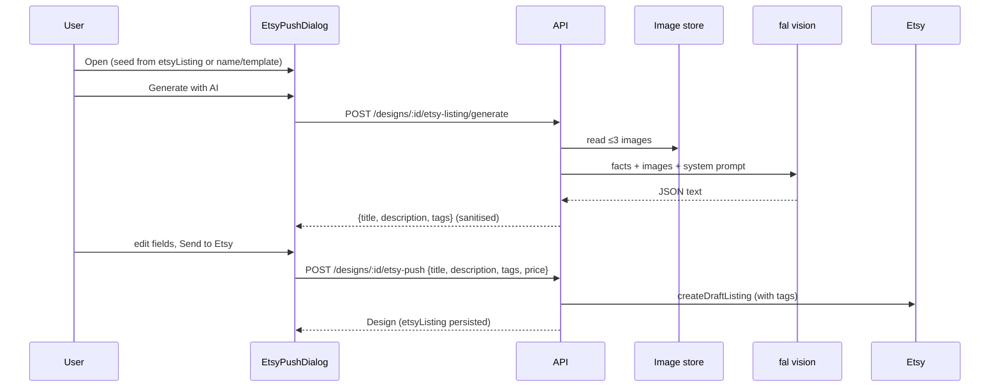

# AI-Generated Etsy Listing Copy (Title, Description, Tags)

**Date:** 2026-10-09
**Status:** Design approved, pending implementation plan.
**Kanban:** `jewellery-catalogue-shop-description-field` (scope widened from description-only to title + description + tags).

## Problem

Pushing a design to Etsy (`EtsyPushDialog` → `POST /api/designs/:id/etsy-push` → `EtsyPushService.push`) produces weak listings:

- **Title** is `design.name` verbatim (`EtsyPushService/mappers.ts` `buildDraftListingInput`). It is not shown in the dialog, not editable at push time, and has no 140-char check.
- **Description** is plain `{description}`/`{materials}` substitution into the per-user `etsyDescriptionTemplate`. `{materials}` is just a comma list of material names. Metal, bead colour, size and length are never used.
- **Tags** are not sent at all. `EtsyDraftListingInput` and the `createDraftListing` body have no `tags`, so every pushed listing has zero tags, which hurts Etsy search.

No LLM is wired anywhere in the repo.

## Goal

In the push dialog, an explicit **Generate with AI** action fills an SEO-friendly Etsy **title**, **description** and **13 tags**. It uses the design's structured data plus its photos. All three fields stay editable before sending, and they are saved on the design so they come back when the dialog is reopened.

## Non-goals

- No automatic generation when the dialog opens. Generation costs money and only runs on click.
- No image generation, and nothing wired to `ImageService`'s unused `ImageGenerator`.
- No editing of tags or title on Etsy after the first push. Sync-back and update-listing stay out of scope; this applies only at draft creation or a resumed incomplete push.
- No new size/colour fields on Design. Size and colour come from materials and photos (see Inputs).
- The demo/onboarding card is not touched.

## Decisions

### Provider: fal.ai vision router

- Endpoint: `POST https://fal.run/openrouter/router/vision`, header `Authorization: Key $FAL_KEY`. Body: `{ image_urls, prompt, system_prompt, model, temperature, max_tokens }`. Response: `{ output: string, usage }`.
- Model comes from `FAL_MODEL`, default `google/gemini-2.5-flash`. It is vision-capable and cheap (about $0.001 per call at 1.4k tokens, per the fal docs example).
- This is the same vendor and key style as shoppingo's `FalLlmClient` (`shoppingo/packages/api/src/infrastructure/FalLlmClient`). We copy its pattern (JSON extraction, Zod validation, one retry with the validation issues fed back, timeout, 502 on failure) and don't build a new one.
- `FAL_KEY` and `FAL_MODEL` are optional config entries. Without `FAL_KEY`, generation returns **503 "AI generation is not configured"**. Everything else works unchanged.

### Images

The bucket is private (images are served through the authenticated API), so fal cannot fetch our URLs. The service reads up to the **first 3** `design.imageIds` through `ImageService.getImage` and sends them as `data:<contentType>;base64,...` entries in `image_urls`. A design with no images still generates from text alone.

### Inputs (the facts block)

This is built server-side from the design, so the client can't inject anything:

- `name`, `designType`, and `htmlToPlainText(description)`
- each `RequiredMaterial`: `name`, `type`, plus `metalType` / `wireType` / `diameter` (mm) / `colour` / `requiredLength` / `requiredQuantity` where present
- variation groups: group name → option material names
- `price` is left out, because it doesn't belong in copy.

From the photos the model infers visible colour, shape, style and approximate proportions. The prompt forbids inventing measurements: sizes appear only if derivable from the facts (e.g. chain `requiredLength`, bead `diameter`).

### Etsy rules (shared constants in `packages/types`)

- `ETSY_TITLE_MAX = 140`
- `ETSY_TAGS_MAX = 13`
- `ETSY_TAG_MAX_LENGTH = 20`
- tag charset: letters, digits, spaces, `-`, `'`, and `™©®`
- title: at most one each of `%`, `:`, `&`; no ALL-CAPS words longer than 3 letters

### Prompt (system)

The system prompt states the role (Etsy SEO copywriter for a handmade jewellery shop, UK English), lists the rules above, and asks for **JSON only**: `{ "title": string, "description": string, "tags": string[] }`. Guidance:

- **Title:** the most-searched keyword phrase first (e.g. "Silver Wire Wrapped Amethyst Drop Earrings"), then material, colour, style and gift context. Natural reading, no keyword stuffing, no repeated words.
- **Tags:** exactly 13 distinct multi-word buyer phrases, at most 20 chars each, covering item type, material, colour, style, occasion/recipient and gemstone. Don't just repeat the title word for word; use Etsy-shopper vocabulary.
- **Description:** plain text, no markdown. A 1–2 sentence hook with the main keywords, a details section (materials, colours, sizes only if known, variations offered), and care plus a handmade/gift note. Use only facts given or visible; never invent gemstones the facts don't support. If a bead's material is unknown, describe the colour.

### Server-side sanitising (`sanitiseListingCopy`, pure)

The Zod schema accepts the raw model output. The sanitiser then:

- trims the title, cuts it at a word boundary to ≤140 chars, and collapses whitespace
- cleans each tag: trims, lowercases, removes disallowed characters, collapses spaces, drops tags that are empty or >20 chars, dedupes case-insensitively, caps at 13
- normalises the description's line endings and trims it

If the result has an empty title or description, it is treated as an invalid reply, which triggers the retry and then a 502. Fewer than 13 tags is allowed; the user can add more.

### Persistence

The Design gains an optional `etsyListing?: { title: string; description: string; tags: string[] }` (Zod: title max 140, tags max 13, each max 20).

- `POST /api/designs/:id/etsy-listing/generate` **does not save**. It returns `{ title, description, tags }`.
- `POST /api/designs/:id/etsy-push` accepts optional `title` and `tags` alongside `description` and `price`, validated against the same constraints (400 on violation). On a successful push it saves `etsyListing = { title, description, tags }` on the design.
- The dialog seeds its fields in this order: `design.etsyListing` if present, else title = `design.name`, description = rendered template (existing behaviour), tags = `[]`.

Saving only on push matches the existing "edit, then confirm" behaviour. Closing the dialog without sending throws away unsent edits, which is the same as today for description and price.

### Push payload

- `EtsyDraftListingInput` gains `tags: string[]`.
- `createDraftListing` sends `tags` (a JSON array), and only when the array is non-empty.
- `buildDraftListingInput` takes `title`, defaulting to `design.name`.

## Components

| Unit | Location | Responsibility |
|---|---|---|
| Etsy constants + `etsyListingSchema` | `packages/types/src/etsy/` (or alongside `design`) | Shared limits and validation for web and api |
| `FalVisionClient` | `packages/api/src/infrastructure/FalVisionClient/` | HTTP to fal vision router; `completeStructured({ operation, schema, system, prompt, imageUrls })` with JSON extraction, Zod validation, retry, timeout, 502 |
| `buildListingFacts`, `LISTING_SYSTEM_PROMPT`, `sanitiseListingCopy` | `packages/api/src/domain/EtsyListingCopyService/prompt.ts` | Pure functions: design → facts text, the prompt, and output cleanup |
| `EtsyListingCopyService.generate(designId, userId)` | `packages/api/src/domain/EtsyListingCopyService/index.ts` | Loads the user-scoped design (404), loads ≤3 images as data URIs, calls the client, returns sanitised copy; 503 when unconfigured |
| Handler + route | `handlers/` + `routes/index.ts` `POST /api/designs/:id/etsy-listing/generate` (authenticate) | Thin wrapper |
| DI wiring | `dependencies/index.ts`, `config/index.ts`, `.env.example` | `FAL_KEY` and `FAL_MODEL` (optional) |
| `EtsyPushService.push` overrides | existing | `title`, `tags` passthrough, persists `etsyListing` |
| `useGenerateEtsyListing(designId)` | `packages/web/src/hooks/` | Mutation hook (same pattern as `useEtsyPush`) |
| `TagInput` | `packages/web/src/components/TagInput/` | Chips: type then Enter/comma to add, × or Backspace to remove, `n/13` counter, blocks invalid or over-length tags |
| `EtsyPushDialog` | existing | Adds the Title input (`n/140`) and TagInput, plus a **Generate with AI** button with loading state and an error alert; Send is disabled when the title or description is empty |

## Data flow

## Error handling

- No `FAL_KEY` → 503; the dialog shows "AI generation isn't configured" and the fields are left as they were.
- fal non-2xx, timeout, or an invalid reply after retry → 502; the dialog shows an error and the fields are left as they were.
- An image read fails → that image is skipped and a warning is logged. Generation goes ahead with the remaining images, or text only if none load.
- Design not found or not owned → 404, using the same scoping as push.
- An invalid title or tags in the push body → 400. The push is never sent with an empty description (existing guard kept).

## Testing

- **Unit (api, `bun test`):**
  - `sanitiseListingCopy` covers boundaries: title of 140 vs 141 chars cut at a word boundary; tags of 20 vs 21 chars, invalid characters, duplicates, more than 13.
  - `buildListingFacts` includes metal, colour, diameter, length and variations, and leaves out price.
  - `FalVisionClient` with fetch mocked: correct URL, auth header and body; retry on invalid JSON; 502 after the last attempt; timeout.
  - `EtsyListingCopyService`: 503 when unconfigured, 404 on another user's design, images capped at 3 and sent as data URIs.
  - `EtsyPushService`: title and tags reach `createDraftListing`; `etsyListing` is saved; with no overrides it falls back to name/template.
  - `EtsyClient`: `tags` are in the body only when non-empty.
- **Unit (web, vitest):** `TagInput` rejects over-length tags and stops at 13.
- **E2E (Playwright):** mock the generate endpoint; click Generate; the fields fill; edit the title and remove a tag; Send; the intercepted push body carries the edited title and tags. A generate failure keeps the template text and shows an error. Existing `design-edit-no-etsy-push` and other Etsy specs still pass.
- **Live smoke:** needs a real `FAL_KEY`. None is available locally (shoppingo's `.env` holds a placeholder), so the live call is checked against the fal docs request shape and has to be confirmed after deploy with the key set in Dokploy.

## Rollout

- Add `FAL_KEY` (and optionally `FAL_MODEL`) to the Dokploy API environment. Until then the button returns the 503 message and push works as before.
- The `etsyDescriptionTemplate` setting stays as the default description for users who never generate.
